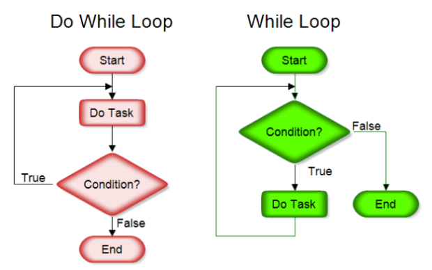

# Notes

## Input (pop-up window)
```javascript
var traveler = prompt();
console.log(traveler);
```

* Nan - Not-A-Number
```html
function sanitise(x) {
  if (isNaN(x)) {
    return NaN;
  }
  return x;
}

console.log(sanitise('1'));
// expected output: "1"

console.log(sanitise('NotANumber'));
// expected output: NaN
```
* Function statements a function expressions v JavaScriptu

## Strict equality (===)

Unlike the equality operator, the strict equality operator always considers operands of different types to be different.

```javascript
console.log(1 === 1);
// expected output: true

console.log('hello' === 'hello');
// expected output: true

console.log('1' ===  1);
// expected output: false

console.log(0 === false);
// expected output: false
```

## Difference between arrow functions and regular functions

```javascript
const map1 = array1.map((x) => {
    return x * 2;
    });
```

```javascript
const map1 = array1.map(x  => x * 2);
```

## Links

* Heroku <a href="https://dashboard.heroku.com/">here</a>
* Rosti.cz <a href="https://rosti.cz/"> here</a>
* Rosti.cz - Automatizovaný deployment s dockerem napojený na github a travis(wokrshop) <a href="https://www.youtube.com/watch?v=JQng3Utewo0&list=PLVqtbc0z8jiFpAFP0jwlhlofA4iKfraux&index=2"> here</a>


## JobInterview

* JIRA, GIT, SVN
* CI/CD => Continous Integration/Contionous Deployment (Deliver)
* PowerShell, Windows batch
* DES => Depth-first-search (FRESH, CLOSED, OPEN)
* BFS => Breadth-first search
* Queue (FIFO)  => Fronta
* Stack (LIFO) => Zásobník 
* Asymptotická složitost


## Array (Pole)

```javascript
var employees = ["David", "Jane", "Diana"];
console.log(employees);

/*
    push - prida na konec
    unshift - prida na zacatek

    pop - odebere posledni
    shift - odebere prvni
 */
employees.push("Jarda");
employees.unshift("Adam");
console.log(employees);

employees.pop();
employees.shift();
console.log(employees);
```

## Metody - funkce v objektu jsou metody

## While Cycle / DoWhile Cycle

FOR => Zname presny pocet opakovani
While => NEzname presny pocet opakovani
<p>

</p>

```javascript
// FOR cycle
console.log("FOR cycle");
for(var i = 0; i < 0; i++){
    console.log("jarda" + i);
}

// WHILE cycle
console.log("\nWHILE cycle");
i = 0;
while (i < 0){                      // zastavi ihned
    console.log("jarda" + i);
    i++;
}

// DO WHILE cycle (provede se min 1 provedl)
console.log("\nDO WHILE cycle");
var i = 0;
do {
    console.log("jarda" + i);       // zastavi ihned
    i++;
}while (i < 0);
```

## Break&Continue

* break - zpusobi ukonceni cyklu
* continue - zastavi pruchod cyklem, ale cyklus pokračuje dal (napr. zastavi prvni pruchod cyklem, ale pokracuje dal druhym opakovanim)

```javascript
    console.log(i);
    if(wanted[i] === traveler){
        console.log("Je hledan");
        // break;                          // castavi cely FOR
        continue;                    // zastavi jen iteraci
    }
```